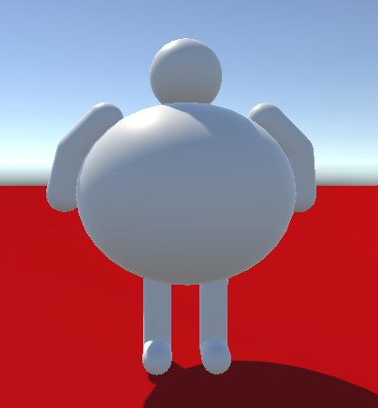
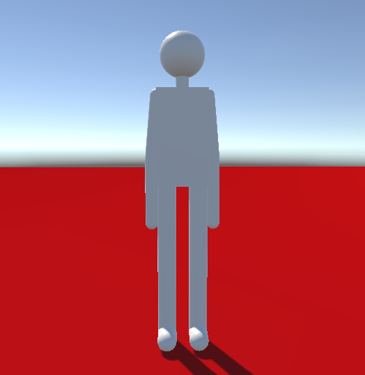

# SicKillers Game
An academic FPS game designed to teach how the immune system works in a playful and accessible way.  
The idea is to create a cooperative multiplayer (co-op) experience where players join forces to fight specific diseases.

## Team
- Guilherme (@GuilhermeGasparr): UI / HUD
- Davi (@DaviJannsen): Gameplay Programmer
- David (@HumDavid): Gameplay Programmer & Designer
- Glauco (@GlaucoCiprianoMoreira): Gameplay Programmer

## Status
**Early Development**

- Core concept defined  
- Mechanics adjustments and detailing in progress  
- Initial character design phase  

Initial prototype of two of the playable classes (B Lymphocyte and Killer):

